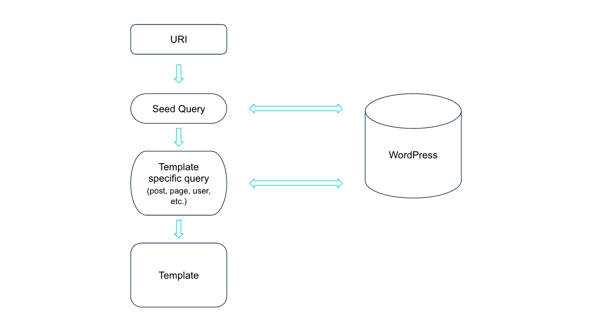

Seed query is an initial request sent to WordPress to determine the type and basic properties of the content. It's the first step in fetching the content from WordPress, but it does not fetch the content itself on its own.

Since faust.js tries to mimic the native [template hierarchy of WordPress](https://developer.wordpress.org/themes/basics/template-hierarchy/), seed query plays a crucial role in the data flow. It helps faust.js to have the required information to determine which template to render.

Here’s a simplified workflow of how faust.js uses the seed query:



1. User requests a page with a URI (e.g. faustexample.wpengine.com **/sample-page/** )
2. Faust.js sends seed Query
3. Seed query returns the template type and properties
4. Faust.js sends template specific queries and retrieves the whole content based on the query
5. Template being rendered with the content

In faust.js seed query looks like this:

```js title="packages/faustwp-core/src/queries/seedQuery.ts"
export const SEED_QUERY = gql`
	query GetSeedNode(
		$id: ID! = 0
		$uri: String! = ""
		$asPreview: Boolean = false
	) {
		... on RootQuery @skip(if: $asPreview) {
			nodeByUri(uri: $uri) {
				__typename
				...GetNode
			}
		}
		... on RootQuery @include(if: $asPreview) {
			contentNode(id: $id, idType: DATABASE_ID, asPreview: true) {
				__typename
				...GetNode
			}
		}
	}
`;
```

As you can see seed query relies on [nodeByUri](https://www.wpgraphql.com/2021/12/23/query-any-page-by-its-path-using-wpgraphql) and contentNode queries of WpGraphQL. In this case contentNode is being used for previews and nodeByUri for ordinary queries. Both of these queries will return the important information about the requested content with a minimal input, whether it is URI or ID.

Below you can see the fragments that are being used in seed query to get the content-specific data, based on the content type.

```js title="packages/faustwp-core/src/queries/seedQuery.ts"
gql`
	fragment GetNode on UniformResourceIdentifiable {
		__typename
		uri
		id
		...DatabaseIdentifier
		...ContentType
		...User
		...TermNode
		...ContentNode
		...MediaItem
		...Page
	}

	fragment DatabaseIdentifier on DatabaseIdentifier {
		databaseId
	}

	fragment MediaItem on MediaItem {
		id
		mimeType
	}

	fragment ContentType on ContentType {
		name
		isFrontPage
		isPostsPage
	}

	fragment Page on Page {
		isFrontPage
		isPostsPage
	}

	fragment TermNode on TermNode {
		isTermNode
		slug
		taxonomyName
	}

	fragment ContentNode on ContentNode {
		isContentNode
		slug
		contentType {
			node {
				name
			}
		}
		template {
			templateName
		}
	}

	fragment User on User {
		name
		userId
		databaseId
	}
`;
```

With this query WpGraphQL returns the unique data structure depending on the content type. Below you can see some of the examples.

Seed query response for a post:

```json
{
	"data": {
		"nodeByUri": {
			"__typename": "Post",
			"uri": "/hello-world/",
			"id": "cG9zdDoxMA==",
			"databaseId": 10,
			"isContentNode": true,
			"slug": "hello-world",
			"contentType": {
				"node": {
					"name": "post"
				}
			},
			"template": {
				"templateName": "Default"
			}
		}
	}
}
```

Seed query response for a user:

```json
{
	"data": {
		"nodeByUri": {
			"__typename": "User",
			"uri": "/author/admin/",
			"id": "dXNlcjox",
			"databaseId": 1,
			"name": "admin",
			"userId": 1
		}
	}
}
```

Seed query response for a page:

```json
{
	"data": {
		"nodeByUri": {
			"__typename": "Page",
			"uri": "/sample-page/",
			"id": "cG9zdDoy",
			"databaseId": 2,
			"isContentNode": true,
			"slug": "sample-page",
			"contentType": {
				"node": {
					"name": "page"
				}
			},
			"template": {
				"templateName": "Default"
			},
			"isFrontPage": false,
			"isPostsPage": false
		}
	}
}
```

Since this query resolved to a node with a page type, faust.js will try to [match the following templates](https://github.com/wpengine/faustjs/blob/canary/packages/faustwp-core/src/getTemplate.ts) in order of appearance:

```js
['page-example', 'page-1470', 'page', 'singular', 'index'];
```

If you want to have a deep understanding of the templating system in faust.js, you can read [this article](https://wpengine.com/builders/understanding-the-templating-system-in-faust-js/).
